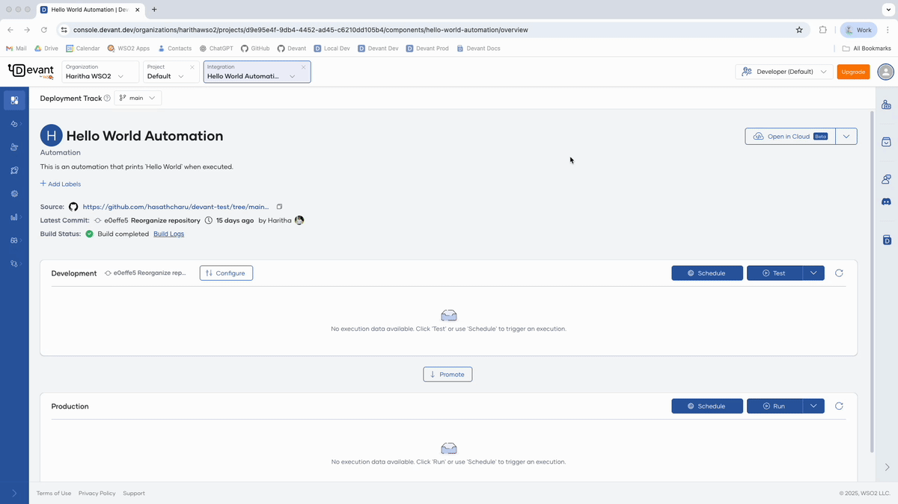

## Overview

In this guide, you will:

- Create a simple automation that prints `"Hello World"` every day.
- Use WSO2 Integrator: BI to develop the automation.
- Push the automation to Devant from the WSO2 Integrator: BI, which automatically builds the automation.
- Schedule the automation to run every day.

## Prerequisites

1. GitHub account: [Create a GitHub account](https://github.com/signup) if you don't have one already.
2. If signing in to Devant for the first time, [create an organization](../references/create-an-organization.md) to begin with.
3. VS Code: [Install VS Code](https://code.visualstudio.com/download) if you don't have it installed already.

## Step 1: Create the new integration

1. Attach a new repository to begin your integration. Refer [Attach a Repository](../references/attach-a-repository.md) for more details.
2. Select the **Technology** as `WSO2 Integrator: BI`.
3. Choose the **Integration Type** as `Automation` and click **Create**.

This redirects you to the **Create New Integration in VS Code** page. 

## Step 2: Install the WSO2 Integrator: BI extension and open the integration

1. Install WSO2 Integrator: BI extension. Refer [Install and Set Up WSO2 Integrator: BI](../references/install-and-setup-wso2-integrator-bi.md) for more details.
2. Click **Develop in WSO2 Integrator: BI**. This will clone your integration project and open it in BI.

## Step 3: Develop automation in WSO2 Integrator: BI

1. In WSO2 Integrator: BI design view, click **Add Artifact**.
2. Select **Automation** from the Constructs menu. Since **Automation** is chosen from the Devant console, other options are disabled.
3. Click **Create** to create an automation. This directs you to the automation diagram view.
4. Click **+** after the **Start** node to open the node panel.
5. Select **Call Function** and select **println**.
6. Click **+ Add Another Value**, type `"Hello World"` and click **Save**.
7. Click **Run** in the top right corner to run the automation. This compiles the automation and runs it in the embedded Ballerina runtime.

    

    
    

## Step 4: Push to Devant

1. Click the **Source Control** icon on the sidebar.
2. Click **+** to stage all changes.
3. Add an appropriate commit message and commit.
4. Click **Sync Changes** to push the changes to remote.

## Step 5: Schedule Automation

1. Once you push the changes, the overview page of the Devant automation will automatically refresh and show you the **Latest Commit** and automatically build your automation showing the **Build Status**.

    !!! note
        The build process may take some time. Once complete, the build status changes to **Success**. You can see the Build History by clicking **Build** in the left navigation.

2. Once the **Build Status** shows `Build completed`, click **Test** to run your automation once.
3. The development card automatically updates with execution details. Click the refresh button in the top right corner if it is not automatically updated.
4. Click **View Logs** on an execution. You will see the `Hello World` log printed along with the execution time.
5. Click **Schedule** to schedule the automation.
6. In the **BY INTERVAL** tab, select **Day** from the dropdown.
7. Enter `1` in the **Repeat every** text box.
8. Enter `01:00 AM` in the **At** text box and click **Update**.
9. Your automation will now run every day at 01:00 AM. You can see the next execution time as **Next run in** in the Development card.

    

    
    

10. After successfully testing, you can promote your automation to production by clicking the **Promote** button.